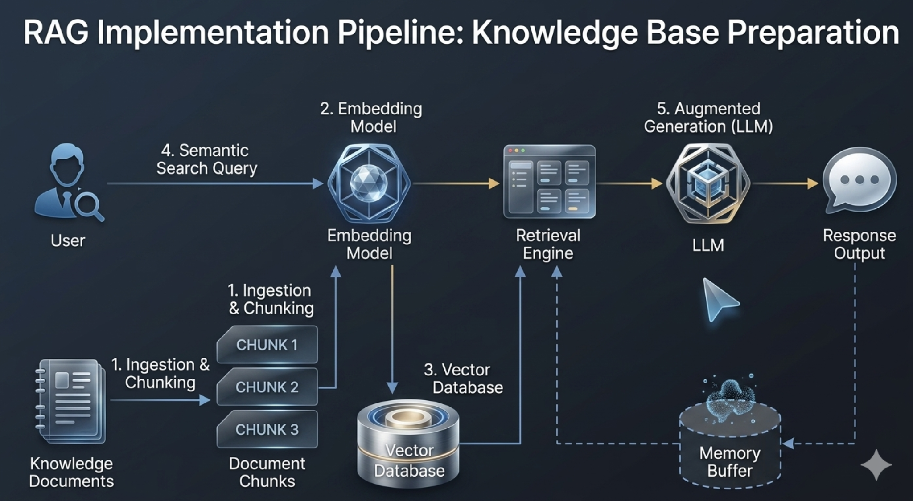

# SSB CPI Hybrid RAG Assistant

This project is being evolved from a compact RAG proof of concept into a hybrid assistant over real open data from Statistics Norway (SSB). The next target is a CPI-focused assistant that combines structured time-series data from SSB Statbank with unstructured SSB documentation, then evaluates the system with a lightweight harness and feedback loop.

The project is intentionally scoped around one topic first: the Consumer Price Index (CPI). CPI is a strong first domain because it has real time-series data, public methodology text, related concepts such as HICP, seasonal adjustment notes, and clear opportunities for future time-series analysis or forecasting.

The core goal is not just to build a chatbot. The goal is to build a system whose answer quality can be defined, measured, compared, and improved.

## Target System

The intended system combines two evidence paths:

```text
User question
    ↓
Question routing
    ↓
Structured SSB table query and/or unstructured document retrieval
    ↓
Grounded answer generation
    ↓
Evaluation harness and feedback loop
```

Example behavior:

- "How has CPI changed in Norway over the last ten years?" should use structured CPI time-series data.
- "What does CPI measure?" should retrieve SSB definition and methodology documents.
- "Explain recent CPI changes and describe how the indicator is defined" should combine structured data with retrieved documentation.

This is a hybrid assistant: structured data handles numeric and time-series questions, while RAG over SSB text handles definitions, methodology, interpretation, and source-grounded explanations.

## Why SSB CPI

SSB is a good data source because it provides both highly structured statistical data and explanatory public documentation.

Structured data comes from SSB Statbank and its API. These tables are organized by dimensions such as time, contents, region, category, and other statistical classifications.

Unstructured data comes from SSB pages such as statistics descriptions, definitions, methodology notes, CPI/HICP explanations, seasonal adjustment notes, API documentation, and table-change records.

CPI is a focused but rich first topic. It supports:

- time-series analysis
- inflation and index interpretation
- CPI vs. HICP explanations
- methodology and weighting changes
- seasonal adjustment questions
- future forecasting or anomaly-detection extensions

The first version should not try to become a full Norway public statistics platform. The current roadmap is to build a high-quality CPI subdomain first, then expand only after the architecture and evaluation harness are stable.

## Current Baseline

The repository currently contains a working modular RAG baseline. That baseline is useful because it has a Streamlit assistant, source citations, retrieval trace, optional LLM-generated answers, and clean module boundaries.

The next project direction is to use real SSB CPI data and documentation, then extend the baseline into a hybrid structured-data plus unstructured-text assistant.



RAG flow: prepare knowledge documents, split them into chunks, convert those chunks into embeddings, store the vector representations with their text and metadata, retrieve the most relevant chunks for a user query, and use the retrieved context for answer generation.

The current baseline uses a local embedding model for vector search. The LLM is connected in the answer-generation layer, not as a replacement for embeddings. Later, the LLM can also help with retrieval planning, query rewriting, reranking, and evidence checks.

## Workflow Explained

### 1. Background Preparation: Data Ingestion

**Step 1. Ingestion and Chunking**

Raw knowledge documents are loaded, cleaned, enriched with metadata, and split into smaller text chunks that can be retrieved later.

**Step 2. Embedding Model**

Each text chunk is converted into a vector representation that captures its semantic meaning.

**Step 3. Vector Database**

The chunk vectors are stored in the vector database together with their original text and metadata.

### 2. User Interaction: Retrieval and Generation

**Step 4. Semantic Search Query**

The user's question is converted into a query vector and compared against the stored chunk vectors to find the most relevant context.

**Retrieval Engine**

**Step 5. Augmented Generation**

The retrieved context and the user question are combined into a prompt that an LLM can use to generate a grounded answer.

The project currently delivers a working retrieval pipeline, assistant orchestration layer, and Streamlit UI. The current baseline can:

- load markdown documents from `data/`
- split them into retrieval chunks
- generate embeddings locally
- rebuild a Chroma vector store from a clean state
- run retrieval queries against that store
- format retrieved chunks into prompt-ready context with stable source labels
- answer through a thin Streamlit chat UI
- show sources, retrieved context, prompt, model, and errors in a retrieval trace
- run in retrieval-only mode without any LLM API key
- call OpenAI-compatible or Anthropic LLM providers when configured in `.env`
- let the user choose between `Retrieval only` and configured LLM providers in the UI sidebar

The intended next data version is SSB CPI text and structured SSB table data.

## MVP Scope

The first real-data implementation should stay small and concrete.

Phase 1 should include only:

- add curated SSB CPI text documents
- add one or two fixed CPI structured datasets from SSB Statbank
- keep a basic structured query path for known CPI questions
- build a retrieval harness for CPI documentation questions
- document the evaluation methodology and feedback-loop design

Phase 1 should avoid:

- full automatic SSB table search
- a broad multi-topic statistics assistant
- a complex router
- a verifier model
- a regression dashboard
- a query-planning agent
- autonomous multi-tool agents

Those are later-stage upgrades. The first milestone should prove that one real domain can be queried, retrieved, evaluated, and improved.

## Proposed Data Layout

The intended data layout is:

```text
data/
├── text/
│   └── cpi/
│       ├── cpi-definition.md
│       ├── about-cpi.md
│       ├── cpi-method-changes.md
│       ├── cpi-seasonal-adjustment.md
│       ├── hicp-vs-cpi.md
│       └── statbank-table-changes.md
├── structured/
│   └── cpi/
│       ├── cpi-monthly.csv
│       ├── cpi-metadata.json
│       └── ssb-query.json
└── evals/
    └── cpi/
        ├── retrieval_cases.json
        ├── expected_sources.json
        └── expected_facts.json
```

The text corpus should be curated rather than broad-scraped. The first version only needs enough source material to answer CPI definition, methodology, HICP comparison, seasonal adjustment, and table-change questions.

Structured data should start with a small number of fixed SSB CPI tables. The project should not begin with general-purpose table discovery. A narrow, known table registry is easier to test and explain.

## Harness Engineering Mindset

The project should be developed with a harness engineer mindset:

```text
What does "good" mean?
How is it measured?
Did a change make the system better?
Did it break another case?
Can failures be captured and reused?
Can the system fail safely?
```

This means answer quality should not be judged only by whether a response "looks good". The system should define explicit quality dimensions:

- `retrieval_quality`: whether top-k chunks contain the expected SSB sources
- `structured_query_correctness`: whether the system selects the right fixed CPI table, metric, and time range
- `routing_correctness`: whether questions are sent to document retrieval, structured query, or hybrid mode
- `grounding_quality`: whether answer claims are supported by retrieved documents and table outputs
- `regression_safety`: whether a new change improves target metrics without breaking old cases
- `latency`: whether added retrieval or generation steps keep the assistant usable
- `fallback_behavior`: whether weak evidence leads to a safer response instead of confident fabrication

The harness is not decoration. It is part of the product design.

## Evaluation Harness

The first evaluation harness should be lightweight and file-based.

Suggested initial structure:

```text
evals/
├── cpi_retrieval_cases.json
├── cpi_structured_cases.json
├── cpi_grounding_cases.json
├── hard_cases.json
└── reports/
```

The first version can start with only `cpi_retrieval_cases.json` and a retrieval evaluation runner.

Example retrieval case:

```json
{
  "id": "cpi_hicp_difference",
  "question": "What is the difference between CPI and HICP?",
  "expected_sources": ["hicp-vs-cpi.md"],
  "expected_keywords": ["harmonised", "international comparison", "coverage"]
}
```

Useful first metrics:

- source hit rate
- top-1 source hit
- top-3 source hit
- expected keyword hit rate
- wrong-topic contamination
- failed cases

Later harness layers can add:

- structured table selection checks
- route classification checks
- answer grounding checks
- baseline comparison reports
- regression reports across chunking, embedding model, top-k, prompt, and LLM provider changes

The goal is not a heavy evaluation platform. The goal is a repeatable, explainable test harness that makes system quality visible.

## Feedback Loop

Feedback loop should not mean only a thumbs-up or thumbs-down button. In this project, feedback loop means that system outputs are evaluated, failures are captured, and those failures become part of future regression tests.

The intended loop is:

```text
Question
    ↓
Retrieval / structured query / answer generation
    ↓
Harness evaluation
    ↓
Failure analysis
    ↓
Add hard case to eval set
    ↓
Run the case again after the next system change
```

This is an evaluation-driven feedback loop. The system does not automatically train itself. Instead, retrieval failures, grounding failures, routing mistakes, and user-reported bad answers are converted into regression and hard-case evaluation sets.

There are three feedback-loop layers:

1. Developer feedback loop

   Every change to chunk size, embedding model, top-k, prompt, router, or LLM provider should be tested on the same fixed cases. This shows whether the change improved one behavior while damaging another.

2. User feedback loop

   Later, the UI can collect feedback such as `helpful`, `not helpful`, `wrong number`, `unsupported answer`, `wrong topic`, or `missing source`. The value is not the button itself; the value is saving the question, route, sources, answer, model, configuration, and feedback label so bad cases can become evaluation cases.

3. System-internal feedback loop

   Later, verifier or confidence checks can change current-turn behavior. For example, unsupported claims can trigger safer fallback, low routing confidence can trigger hybrid mode, and retrieval contamination can trigger stricter filtering.

The first phase should focus on the developer feedback loop. That is the most stable and useful foundation.

## Conversation State / Session Memory

After the CPI data migration, the first user-visible enhancement should be lightweight session memory. In this project, memory should be understood as structured conversation state, not broad long-term personal memory.

The purpose is to make the assistant handle follow-up questions across a statistical analysis task. A user may first ask what CPI means, then ask how it changed over the last ten years, then ask "what about Oslo?", then ask for a simpler explanation. Without session memory, each turn is treated as isolated. With structured conversation state, the assistant can preserve the current topic, metric, region, time range, and route.

The first version should be tighter than a full memory system. It should first prove that `current_topic`, `current_metric`, `current_region`, `current_time_range`, and `last_route` are actually used to resolve follow-up questions. `last_sources` and `last_structured_table` can be recorded from the beginning, but they do not need to drive core logic on day one.

Initial state shape:

```json
{
  "current_topic": "cpi",
  "current_metric": "CPI",
  "current_region": "Norway",
  "current_time_range": "last_10_years",
  "last_route": "hybrid",
  "last_sources": ["cpi-definition.md", "about-cpi.md"],
  "last_structured_table": "monthly_cpi",
  "preferred_language": "English"
}
```

This should be implemented as explicit context management, ideally in a dedicated module such as `src/conversation_state.py`, rather than as hidden logic inside `app.py`.

Recommended first responsibilities for `conversation_state.py`:

- define a `ConversationState` schema
- create and reset state
- update state after each turn
- resolve simple follow-up references such as `it`, `that`, `same period`, or `what about Oslo`
- serialize state for feedback logs and evaluation artifacts
- apply conservative inheritance rules when the user's intent clearly shifts

The UI can store the state in Streamlit session state, but it should not own the state logic. `app.py` should display the current context and provide a clear/reset action. The assistant, router, structured query layer, retrieval planner, feedback logger, and future agents should read the same explicit state object.

State reset and inheritance should be conservative. The assistant should inherit context for clear follow-up questions, but it should weaken or reset state when the user clearly changes topic, metric, region, or analysis task. For example, a move from CPI to unemployment, housing prices, or another unrelated SSB topic should not silently reuse the old CPI context. The current state must be user-visible and resettable.

The intended relationship is:

```text
app.py
    ↓
loads ConversationState from UI session
    ↓
src.assistant.answer_question(question, conversation_state)
    ↓
router or future query planning agent reads state
    ↓
retrieval and/or structured query executes
    ↓
answer is generated
    ↓
conversation_state is updated
    ↓
response, updated state, and trace are returned to the UI
```

Session memory should be:

- structured
- visible
- resettable
- limited to the current task
- logged when useful for feedback analysis
- separate from future long-term preference memory

The project should avoid hidden long-term memory in the first version. Persistent memory can be considered later for low-risk preferences such as language or explanation depth, but it should not be the first memory layer.

## Controlled Agentic Layer

Agents should be added later, and only in controlled roles.

The project should not start with an autonomous multi-tool agent. For this domain, reliability, source grounding, and evaluation matter more than open-ended autonomy.

Future agents should not own implicit memory. They should explicitly receive `ConversationState` as input and, when needed, return a proposed state update through a clear interface. This makes agent decisions easier to inspect and debug.

The first useful agentic component would be a query planning agent. It should not answer the user directly. Its job would be to convert a natural-language question into a structured execution plan.

Example planner output:

```json
{
  "conversation_state": {
    "current_topic": "cpi",
    "current_metric": "CPI-ATE",
    "current_region": "Norway"
  },
  "route": "hybrid",
  "topic": "cpi",
  "structured_query": {
    "table": "monthly_cpi",
    "metric": "CPI total index",
    "time_range": "last_10_years"
  },
  "retrieval_query": {
    "documents": ["cpi-definition", "about-cpi", "methodology"],
    "query": "CPI definition and measurement method"
  },
  "answer_requirements": [
    "summarize trend",
    "cite structured data",
    "explain definition",
    "cite SSB text sources"
  ]
}
```

A later answer verification agent can check whether numbers came from structured data, definitions came from SSB text, CPI and HICP were not confused, and unsupported claims were not introduced.

Recommended order:

```text
1. CPI-only SSB hybrid assistant
2. lightweight session memory / conversation state
3. retrieval harness
4. fixed structured query path
5. hybrid answer with citations
6. regression and grounding checks
7. controlled query planning agent
8. answer verification agent
```

## Current Integration Level

The project is connected end to end at the Phase 3 level:

```text
app.py
    ↓
src.assistant.answer_question(...)
    ↓
src.query.query(...)
    ↓
src.rag_pipeline.build_prompt(...)
    ↓
src.llm.generate_answer(...)
    ↓
AssistantResponse
```

What is fully wired now:

- `app.py` should stay thin and only handle UI concerns
- `src/assistant.py` coordinates retrieval, prompt construction, LLM generation, and response-status mapping
- `src/query.py` performs vector retrieval against Chroma
- `src/rag_pipeline.py` formats source labels, retrieved context, and prompts
- `src/llm.py` handles provider-specific LLM calls through one `generate_answer(...)` entrypoint
- `src/schemas.py` defines the structured response objects used by the UI
- `.env` controls which LLM providers appear in the sidebar

`src/assistant.py` is the public assistant service boundary for the app. Its purpose is to expose a small, stable function such as `answer_question(...)` that coordinates retrieval, prompt building, LLM generation, and response-status mapping. This keeps `app.py` focused on Streamlit UI work and prevents UI code from depending on Chroma, embeddings, prompt internals, or provider-specific LLM details.

`src/assistant.py` should not become a place for low-level retrieval algorithms or provider-specific HTTP logic. Those responsibilities stay in modules such as `src/query.py`, `src/rag_pipeline.py`, and `src/llm.py`.

The retrieval result should be structured from the beginning instead of returning only raw documents or a plain context string. The first version can include:

- `question`
- `retrieved_chunks`
- `source_labels`
- `context_block`
- `topic_filter_used`
- `retrieval_notes`

The assistant response can include:

- `question`
- `status`
- `answer`
- `sources`
- `retrieved_context`
- `prompt`
- `model_name`
- `error`

The `status` field should be included from the first version so the UI can decide how to present the result. Expected initial statuses:

- `answered`: retrieval and LLM generation both succeeded
- `retrieval_only`: retrieval worked, but no LLM was configured, so the app shows retrieved context or a prompt-ready fallback
- `no_results`: retrieval returned no useful context
- `configuration_error`: required settings such as an LLM API key or base URL are missing or invalid
- `runtime_error`: an unexpected error happened during retrieval or generation

Response contract conventions:

- UI display values must be normalized before reaching low-level retrieval. In the SSB CPI direction, selection should become topic, route, and table routing.
- `RetrievedContext.source_labels` means labels produced by retrieval for the retrieved chunks.
- `AssistantResponse.sources` means the final UI-facing source list for the answer. In the first version it may match `RetrievedContext.source_labels`; later it may contain only sources actually cited by the generated answer.
- `RetrievedContext.retrieved_chunks` may keep LangChain `Document` objects internally, but `app.py` should not depend on detailed `Document.metadata` structure.
- `AssistantResponse.prompt` stores the full prompt for trace/debug use. The UI can choose to hide it in an expander or show a shortened preview.

This gives the app a stable data contract. Future retrieval upgrades can add fields such as:

- `rewritten_queries`
- `subqueries`
- `rerank_scores`
- `evidence_status`
- `retrieval_rounds`
- `confidence`

## Future Hybrid Architecture Direction

After the baseline is stable, the assistant can be upgraded without rewriting the UI.

Potential hybrid layers:

- conversation state: track topic, metric, region, time range, route, and last sources across turns
- query understanding: identify whether the question needs documents, structured data, or both
- query rewriting: turn vague questions into searchable questions
- multi-query retrieval: split complex questions into several searches
- structured CPI query: select a known SSB CPI table, metric, and time range
- multi-hop retrieval: gather evidence from related definition, methodology, HICP, and seasonal-adjustment documents
- reranking: prioritize the chunks that best support the answer
- evidence sufficiency checks: decide whether the retrieved context is enough

The LLM should not replace the embedding model or the structured data path. Later, it can act as a controlled planner on top of vector search and fixed structured queries:

```text
User question
    ↓
Question understanding
    ↓
Query planning
    ↓
Structured CPI query and/or vector retrieval
    ↓
Reranking / evidence selection
    ↓
Evidence sufficiency check
    ↓
Answer generation with citations
```

## Current Status

Implemented now:

- modular RAG pipeline under `src/`
- rebuild-style indexing pipeline
- stable `chunk_id` identity from chunking to storage to display
- query input guardrails
- prompt-ready context orchestration in `src.rag_pipeline`
- structured response objects in `src.schemas`
- LLM provider boundary in `src.llm`
- assistant orchestration boundary in `src.assistant`
- Streamlit chat UI in `app.py`
- `.env`-based LLM provider selection
- retrieval-only fallback when no LLM is selected or configured
- Anthropic generation path tested with a real provider key
- direct `Retrieval only` mode and `answered` mode tested through the assistant path

Not implemented yet:

- SSB CPI data replacement
- fixed structured CPI query path
- retrieval evaluation harness
- feedback-loop artifact capture
- relevance threshold / evidence sufficiency checks for weak retrieval results

## Project Structure

```text
RAG-knowledge-assistant/
├── AGENTS.md
├── README.md
├── pyproject.toml
├── uv.lock
├── app.py
├── data/
│   └── target is SSB CPI text and structured data
├── src/
│   ├── __init__.py
│   ├── assistant.py
│   ├── chunking.py
│   ├── config.py
│   ├── data_loader.py
│   ├── embeddings.py
│   ├── indexing.py
│   ├── llm.py
│   ├── query.py
│   ├── rag_pipeline.py
│   ├── schemas.py
│   └── vectorstore.py
└── vectorstore/
```

## Data

The target corpus is real SSB CPI material.

The target corpus is:

- curated SSB CPI text documents for definitions, methodology, CPI/HICP comparison, seasonal adjustment, method changes, and table changes
- one or two fixed CPI structured datasets from SSB Statbank
- file-based evaluation cases for retrieval, structured query behavior, grounding, and later regression

The first real-data version should be CPI-only. Expanding to unemployment, population, or other SSB topics should come after the CPI harness and hybrid path are stable.

## Tech Stack

- Python 3.11+
- LangChain
- ChromaDB
- `sentence-transformers`
- `paraphrase-multilingual-MiniLM-L12-v2`
- `uv` for dependency management

Dependencies are defined in `pyproject.toml`.

## Portfolio Positioning

The intended project story is:

> Built a modular hybrid assistant over SSB public CPI data, combining structured Statbank time-series queries with retrieval over SSB methodology and definition documents. Designed an evaluation harness and feedback loop to measure retrieval precision, structured query correctness, grounding quality, routing accuracy, and regression across configuration changes.

The important distinction is that this is not only an answer-generation project. It is a project about building the ability to verify and improve answer-system quality.
